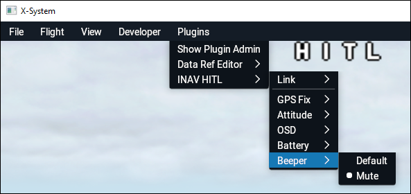

# INAV X-Plane HITL plugin

**Hardware-in-the-loop** plugin for **X-Plane 11** for **INAV Flight Controller firmware**: https://github.com/iNavFlight/inav

# Motivation

I believe that good testing and debugging tools are key points to achieve software stability.

It is not Ok when people debug autopilot by running with a plane on the field :smiley:

I hope this plugin can help improve INAV firmware.

While not been a main purpose, plugin can be used to improve pilot skils or getting familiar with INAV options.

# How it works

**X-Plane** 11 https://www.x-plane.com/ is flight simulator with accurate physics simulation. 
 
X-Plane is extendable with plugins. This plugin connects to Flight Controller through USB cable and passes gyroscope, accelerometer, barometer and GPS data, which replace data from physical sensors. 

FC sends back **yaw/pitch/roll** controls which are passed to X-Plane.

# Setup (Windows)

Plugin is **Aircraft** plugin.

The contents of `release\Aircraft` folder should be placed in the Aircraft folder of X-Plane: `X-Plane11\Aircraft\`.

This will add plugin to the **Aerolite** airplane and install additional **NK_Surfwing** flying wing model with this plugin.

You have to build and flash Simulator-enabled INAV firmware from branch: https://github.com/RomanLut/inav/tree/master-simulator-xplane . Simulator mode is not included in main INAV repository currently.

## Installation steps

- Install **X-Plane 11 demo** from: https://www.x-plane.com/desktop/try-it/
- Copy `release\Aircraft` folder to `X-Plane 11\Aircraft` folder in **X-Plane** installation location. 
- Connect Flight Controller to PC using USB Cable
- Configure FC (see **Flight Controller configuration** below)
- Start **X-Plane 11**
- Select Aircraft **Aerolite 103** or **NK Surfwing**
- Start flight
- Select **Plugins->INAV HITL->Link->Connect to flight controller**. Plugin should automatically detect COM port.
- Flight using RC Controller, setup PIDs etc. Hint: disable brakes with "B" key. 

*Note:Use **"Internal View/Forward with No Display"** for full immersion FPV flights:*

# Setup (Linux)

 Sorry, Linux in not supported currently *(assistance needed to build plugin for Linux, see [development.md](doc/development.md))*.
 
# Flight controller configuration

Flight controller should be fully configured like for the real flight. There is no need to calibrate mixer and motors output.

Configure **Aircraft with tail** for **Aerolite** and **Fixed wing** for **NK Sufwing**. It possible to use plugin with any other models (copy plugin to corresponding Aircraft subfolder).

Platforms other than "Airplane" are not supported.

*Note: If FC is mouted on UAV, you can use profiles to have different PIDs for simulated airplane. Motor and Servo outputs are disabled in simulation mode.*

*Note: There is no need to connect battery, if receiver is powered from USB connection.*

## Pids and rates

See recommended starting pids for **Aerolite** (Aircraft with tail ) [aerolite.md](doc/aerolite/aerolite.md)

See recommended starting pids for **NK SurfWing** (flying wing) [nkfpvsurfwing.md](doc/nkfpvsufrwing/nkfpvsurfwing.md)

# Sensors simulation

Plugin will simulate sensors, enabled in FC's configuration.

In minimal case, you need FC with some kind of receiver attached. No real barometer and GPS sensors are required. FC with OSD is highly recommended.

There are two modes of simulation:
- **full simulation:** attitude is estimated from sensors data
- **simplified simulation:** attitude is passed from X-Plane.

Due to slow update rate (update rate can not be larger then X-Plane FPS) and no synchronization beetween INAV cycles and **X-Plane** FPS, full emulation mode will show noticeable problems with estimation ( hickups, drifting horizon ). **Simplified emulation is recommended for debugging code not related to IMU**.

Sensors not listed below are not simulated. Please disable in INAV configuration.

## Accelerometer and gyroscope

Real acceleromerer should be calibrated in **INAV Configurator**.

## Barometer

Barometer will be simulatod if enabled in **INAV Configurator**. If real barometer is not present, select **"FAKE"** type.

## GPS

GPS functionality will be emulated if enabled in **INAV Configurator**. It is not required to have real GPS sensor connected.

X-Plane simulated world is build based on real world map data. GPS coordinates in game correspond to real locations. 

Simulated GPS Fix can be switched in menu:

## Magnetometer

Magnetometer is not supported currently *(assistance needed to implement magnetometer support, see [development.md](doc/development.md))*.

Magnetometer will be disabled in simulation.

## Battery sensor

For convience, it is possible to simulate 3S battery presense:

# OSD 

OSD is rendered in **X-Plane** exactly as configured in **INAV Configurator**. 

It is highly recommended to use Flight Controller with OSD to see system messages on screen.

The following requirements should be met to have OSD drawn in **X-Plane**:

- OSD should be configured and enabled in **INAV Configurator** ( `AUTO`, `PAL` or `NTSC` type ).
- OSD chip should be present on Flight Controller (MAX7456). OSD will not work without MAX7456 compatible chip. OSD will not work with HD Zero, DJI or Pixel OSD selected in configuration.
- **X-Plane** should **NOT** use **Vulkan** drivers. Please uncheck the following option:

The following options present in menu:

- **None:** disable OSD rendering
- **AUTO:** number of OSD lines is provided by FC
- **PAL:** force rendering of 16 OSD lines
- **NTSC:** force rendering of 13 OSD lines
- **Smoothing: Nearest:** Use nearest pixels for charactes rendering
- **Smoothing: Linear:** Use linear smoothing for charactes rendering

OSD is using **Bold** font from **INAV Configurator**. It is possible to replace font `(\plugins\INAV-X-Plane-HITL\64\assets\osd_font.png)` with other font from **INAV Configurator** https://github.com/iNavFlight/inav-configurator/tree/master/resources/osd

# Beeper

For coonvience, it is possible to mute beeper in simulation mode:

# Development

See [development.md](doc/development.md)

# Links

- X-Plane INAV HITL prototype has been implemented by Sergey Sevrugin: https://github.com/sevrugin/inav/tree/master-simulator-xplane, https://github.com/sevrugin/inav-configurator/tree/master-simulator-xplane

- NK_FPV Surfwing V2 | RC Plane 2.2.0 https://forums.x-plane.org/index.php?/files/file/43974-nk_fpv-surfwing-v2-rc-plane/

- X PLANE TUTORIAL: MaxiSwift installation with X Plane v9.70 for HIL simulations https://github.com/jlnaudin/x-drone/wiki/X-PLANE-TUTORIAL:-MaxiSwift-installation-with-X-Plane-v9.70-for-HIL-simulations

- Quadrotor UAV simulation modelling using X-Plane simulation software http://www.iraj.in/journal/journal_file/journal_pdf/2-448-152361879882-85.pdf
