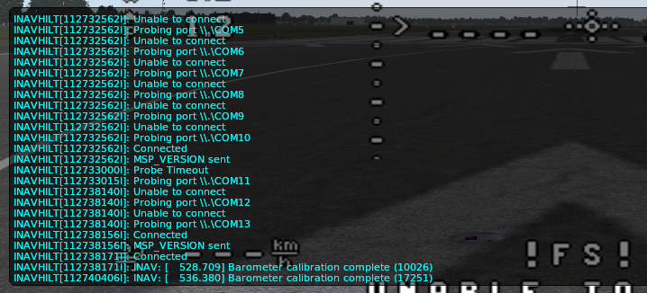
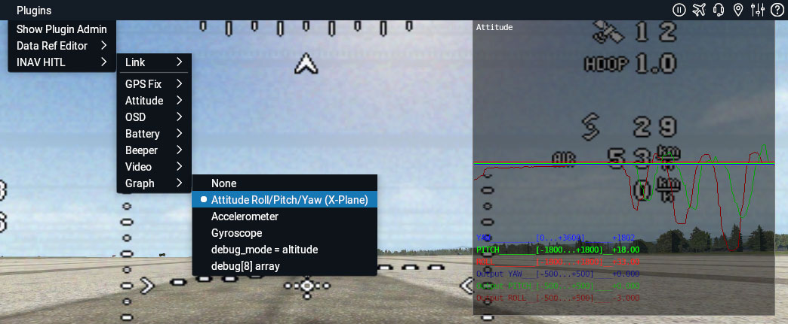

# Development

Plugin is compiled using Microsoft Visual Studio 2017.

# Concerns

Existing MSP commands should not be changed.

Whole simulator communication should be done using single MSP_SIMULATOR command and ARM_SIMULATION flag.

If ARM_SIMULATION flag is not set, behaviour of INAV should not change at all.

For now, plugin supports platforms "Airplane" only.

# Timing

INAV can handle 100 MSP commands per second. By the way, this is the reason why whole symulation communication should be done using single MSP command.

X-Plane renders 40-100 FPS ( physics and rendering ) per second. 

We send new MSP_SIMULATOR command every frame, but not earlier than 10us from last command. This allows to have update rate similar to FPS.

# Debugging

## Plugin->Data Ref Editor->Show Datarefs

Some other datarefs are available under **inav_hitl/** node.

To enable Dataref editor, download plugin from https://developer.x-plane.com/tools/datarefeditor/


## debug[]

8 debug variables from INAV (debug[]) are reflected as debug[N] datarefs in X-Plane as *signed integers*. Update rate is 1/8 of MSG_SIMULATOR rate.

Configure INAV to update debug[] array with predefined parameters, or use in your code:

**cli:**
```
set debug_mode = ALTITUDE
save
```

```
    DEBUG_SET(DEBUG_ALTITUDE, 0, posEstimator.est.pos.z);       // Position estimate
    DEBUG_SET(DEBUG_ALTITUDE, 1, posEstimator.est.vel.z);       // Vertical speed estimate
    DEBUG_SET(DEBUG_ALTITUDE, 2, imuMeasuredAccelBF.z);        // Baro altitude
    DEBUG_SET(DEBUG_ALTITUDE, 3, posEstimator.imu.accelNEU.z);  // Vertical acceleration on earth frame
    DEBUG_SET(DEBUG_ALTITUDE, 4, posEstimator.gps.pos.z);       // GPS altitude
    DEBUG_SET(DEBUG_ALTITUDE, 5, posEstimator.gps.vel.z);       // GPS vertical speed
    DEBUG_SET(DEBUG_ALTITUDE, 6, accGetVibrationLevel());       // Vibration level
    DEBUG_SET(DEBUG_ALTITUDE, 7, accGetClipCount());            // Clip count
```

Check `main\build\debug.h', 'debugType_e` for more modes.


## Developer->Show dev console

INAV serial logging ( see https://github.com/iNavFlight/inav/blob/master/docs/development/serial_printf_debugging.md ) messages are output to Developer console with "INAV: " prefix:



## Graphs



Plugin can draw number of graphs for debugging:
- **Attitude Roll/Pitch/Yaw (X-Plane):** Yaw/Pitch/Roll angles sent to FC in **"Attitude: Copy From X-Plane"** mode. This is NOT attitude estimated by FC. **"Output Yaw/Pitch/Roll"** graphs show **"Stabilized Yaw/Pitch/Roll"** outputs from FC. Graph is usefull for PID tuning.
- **Accelerometer:** Simulated Accelerometer readings
- **Gyroscope:** Simulated Accelerometer readings
- **"debug_mode = altitude:"** Values set to debug[] array with "set debug_mode=allitude" settings of FC
- **"debug[8] array:** Graph of debug[] values. Atuomatic scale. Values are shown as int32_t.
  
  
# Assitance

Assistance required to implement some tasks. Pelase check **Issues** tab. Please leave a note in issue if you are working on this task to avoid collisions. Please provide timing.

