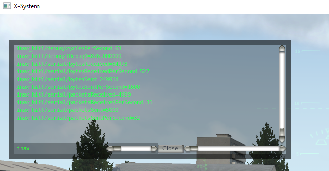

# Development

Plugin is compiled using Microsoft Visual Studio 2017.

## Concerns

Existing MSP commands should not be changed.

Whole simulator communication should be done using single MSP_SIMULATOR command and ARM_SIMULATION flag.

If ARM_SIMULATION flag is not set, behaviour of INAV should not change at all.

For now, plugin supports Aircarft type "Aircraft with tail" only

## Timing

INAV can handle 100 MSP commands per second. By the way, this is the reason why whole symulation communication should be done using single MSP command.

X-Plane does 60 flight loops ( physics and rendering ) per second. 

Theoretically it should be possible to send updates with X-Plane flight loop frequency (60Hz) and get INAV response on the next loop.

In practice, packets rate is ~30-40Hz due to desyncronization of both loops.

## Datarefs

8 debug variables from INAV are reflected as debugN datarefs in X-plane (Update rate is 1/8 of MSG_SIMULATOR rate).

Some other datarefs are available under **inav_hitl/** node for debugging.

