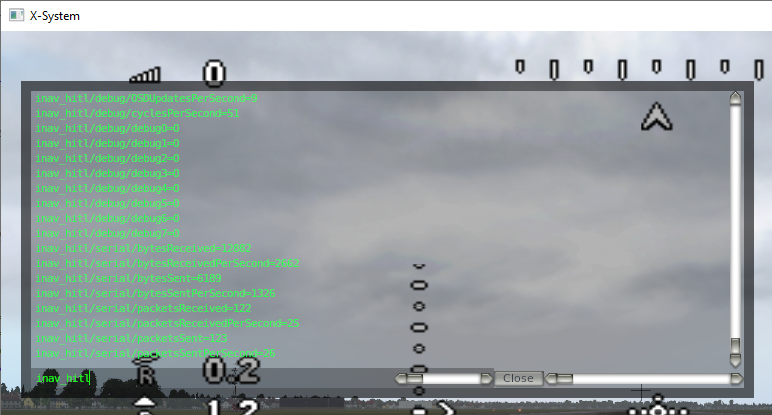

# Development

# Building for Windows

Build with Microsoft Visual Studio 2017.

# Building for Linux

Check Dockerfile for building requirements on Linux https://github.com/RomanLut/INAV-X-Plane-HITL/blob/main/Dockerfile

Can be built on Windows using docker:

```docker build -t inav-hitl-build  .```

```docker run --rm -it -u root -v //d/Github/inav/INAV-X-Plane-HITL-Plugin/INAV-X-Plane-HITL/:/trunk inav-hitl-build ```

# Building in Linux
 
## Command line

Installation of the prerequisites (Debian, Ubuntu and Co.):
```shell
 sudo apt-get update 
 sudo apt-get install ninja-build cmake gcc g++ libgl-dev libglu1-mesa-dev libalut-dev libgtk-3-dev pkg-con
``` 

Building:
```shell
mkdir build
cd build
cmake -GNinja -DOUTPUT_DIR="../release/Aircraft/Extra Aircraft/NK_FPVSurfwing/plugins/INAV-X-Plane-HITL/64" ..
ninja
```

Alternative (using make):
```shell
mkdir build
cd build
cmake -DOUTPUT_DIR="../release/Aircraft/Extra Aircraft/NK_FPVSurfwing/plugins/INAV-X-Plane-HITL/64" ..
make
```

## VSCode

Some predefined tasks are avaiable, use `STRG-Shift-B` to execute the Tasks;

| Task                  | Description                                                                                                                       |
|-----------------------|-----------------------------------------------------------------------------------------------------------------------------------|
|`CMAKE Build Release`: | Prepares a `build` directory for a release build                                                                                  | 
|`CMAKE Build Debug`:   | Prepares a `debug` directory for a debug build                                                                                    |
|`CMAKE Build Release`: | Builds a release build and copies the plugin library to the `release` folder                                                      |
|`CMAKE Build Debug`:   | Builds a debug build and copies the plugin library to the X-Plane folder, edit `setting.json` before, see "Debugging" section.    |
|`Clean Release`:       | Cleans up the build folder                                                                                                        |
|`Clean Debug`:         | Cleans up the debug folder                                                                                                        |

# Concerns

Plugin communicates with FC using MSP protocol.

Existing MSP commands should not be changed.

Whole simulator communication should be done using single ```MSP_SIMULATOR``` command.

If ```ARMING_FLAG(SIMULATOR_MODE)``` is not set, the behaviour of INAV should not change at all.

For now, plugin supports platforms "Airplane" only.

# Timing

INAV can handle 100 MSP commands per second. By the way, this is the reason why whole symulation communication should be done using single MSP command.

X-Plane renders 40-100 FPS ( physics and rendering ) per second. 

We send new MSP_SIMULATOR command every frame, but not earlier than 10us from the last command. This allows to have update rate similar to FPS.

# Debugging

To avoid restarting X-Plane every time, download, build and install this plugin:
[X-Plane Reload Plugins](https://developer.x-plane.com/code-sample/reloadplugins/)

Select in X-PLane: Plugins -> ReloadPlugins -> Reload.
All plugins will now be unloaded.

### Windows / Visual Studio:
Set the path to the HITL plugin under Project Properties -> Build -> Events -> Post-Build Event
Start debugging with Debug -> Attach to Process, and select the X-Plane process

### Linux/VSCode:
Set the path to the HITL plugin in  `.vscode/settings.json`
Start debugging with Run and Debug -> Attach to X-Plane (or just hit F5).

When the project has been rebuilt and successfully attached to X-Plane, click on ‘Understood’ in the reload plugin.
Now you should be able to debug the project directly in X-Plane.

## Plugin->Data Ref Editor->Show Datarefs

Datarefs are available under **inav_hitl/** node.

To enable Dataref editor, download plugin from https://developer.x-plane.com/tools/datarefeditor/



## debug[]

8 debug variables from INAV (debug[]) are reflected as debug[N] datarefs in X-Plane as **int32_t**. Update rate is 1/8 of ```MSG_SIMULATOR``` command rate.

Configure INAV to update **debug[]** array with **debug_mode=...** command, or fill in your code:

**cli:**
```
set debug_mode = ALTITUDE
save
```
Search INAV code to find out how debug[] array is filled in selected mode:
```
    DEBUG_SET(DEBUG_ALTITUDE, 0, posEstimator.est.pos.z);       // Position estimate
    DEBUG_SET(DEBUG_ALTITUDE, 1, posEstimator.est.vel.z);       // Vertical speed estimate
    DEBUG_SET(DEBUG_ALTITUDE, 2, imuMeasuredAccelBF.z);        // Baro altitude
    DEBUG_SET(DEBUG_ALTITUDE, 3, posEstimator.imu.accelNEU.z);  // Vertical acceleration on earth frame
    DEBUG_SET(DEBUG_ALTITUDE, 4, posEstimator.gps.pos.z);       // GPS altitude
    DEBUG_SET(DEBUG_ALTITUDE, 5, posEstimator.gps.vel.z);       // GPS vertical speed
    DEBUG_SET(DEBUG_ALTITUDE, 6, accGetVibrationLevel());       // Vibration level
    DEBUG_SET(DEBUG_ALTITUDE, 7, accGetClipCount());            // Clip count
```

Check inav sources `main\build\debug.h', 'debugType_e` for more modes.


## Developer->Show dev console

INAV serial logging ( see https://github.com/iNavFlight/inav/blob/master/docs/development/serial_printf_debugging.md ) messages are output to Developer console with "INAVHITL: " prefix:


*Note: Please keep rate below ~100 characters per second, otherwise FC will freeze. For high frequencly output, use debug[] array.* 

## Graphs


Plugin can draw a number of graphs for debugging:
- **Updates period:** First graph shows period between updates from FC in ms. Second graph shows number of updates per second.
- **Attitude estimation:** First 3 graphs: real Yaw/Pitch/Roll angles. Next 3 graphs: attitude estimated by FC. In **"Attitude: Copy From X-Plane"** mode, angles are equal. 
- **Attitude, output:** First 3 graphs: Yaw/Pitch/Roll. Next 3 graphs: **"Output Yaw/Pitch/Roll"** = **"Stabilized Yaw/Pitch/Roll"** outputs from FC. Graph is usefull for PID tuning.
- **Accelerometer:** Simulated Accelerometer readings
- **Gyroscope:** Simulated Gyroscope readings
- **"debug_mode = altitude:"** Visualize debug[] array in this mode
- **"debug[8] array:** Graph of debug[] values. Automatic scale. Values are shown as int32_t.

*Hint: To reset automatic scale, select graph in menu again.*
  
  
# Assitance

Assistance required to implement some tasks. Pelase check **Issues** tab. Please leave a note in the issue if you are working on this task to avoid collisions. Please provide timing.

