# Setup (Windows)

Plugin is **Aircraft** plugin.

The contents of `release\Aircraft` folder should be placed in the Aircraft folder of X-Plane: `X-Plane11\Aircraft\`.

This action will add **INAV Surfwing** flying wing model with this plugin.

**IMPORTANT: You have to flash Simulator-enabled INAV firmware. Simulator is supported since INAV 6.**

**Also precompiled binaries of inav 5.0.0 with simulator support are available in early releases of plugin: https://github.com/RomanLut/INAV-X-Plane-HITL/releases/.**

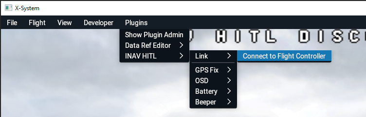

## Installation steps

- Install **X-Plane 11 demo** from: https://www.x-plane.com/desktop/try-it/older/ .  Demo allows to fly for 15 minutes in Seattle region. Than you have to restart the game.
- download **Aircraft.zip** from last release https://github.com/RomanLut/INAV-X-Plane-HITL/releases/
- If upgrading from previous  version, delete folder `X-Plane 11\Aircraft\Extra Aircraft\NK_FPVSurfwing\`
- Unzip, copy `Aircraft` folder to `X-Plane 11\Aircraft` folder in **X-Plane** installation location. 
- Connect Flight Controller to PC using USB Cable. **Make sure FC is flashed with simulator-enabled firmware** - either inav 6.0+ or modified inav 5.0 from releases https://github.com/RomanLut/INAV-X-Plane-HITL/releases/
- Configure FC (see **Flight Controller configuration** below)
- Start **X-Plane 11**
- Set **Settings->General->Flight models per frame** to **10** for better support of small aircrafts
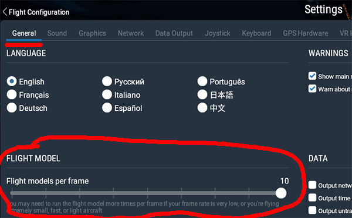
- Select **"Show extra aircraft from older versions"** to see **INAV Surfwing**
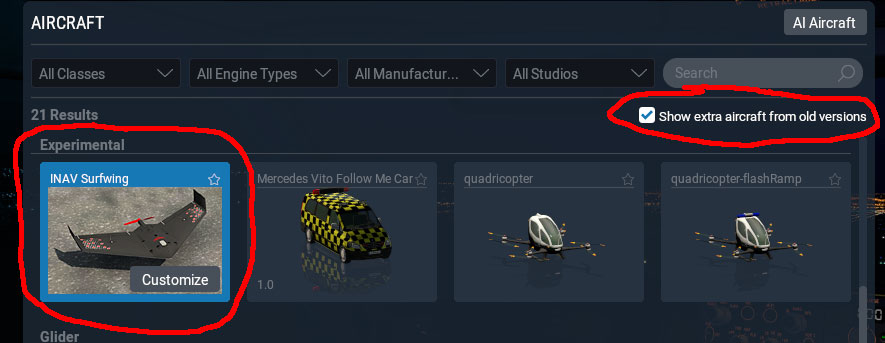
- Select **INAV Surfwing**, start flight
- When scenery is loaded, select **Plugins->INAV HITL->Link->Connect to Flight Controller**. Plugin should automatically detect serial port.
- Flight using RC Controller, setup PIDs etc. 


*Note: Use **"Internal View/Forward with No Display"** for full immersion FPV flights:*

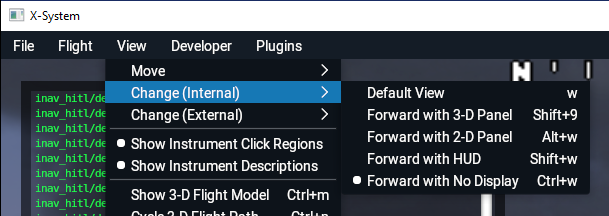

# Setup (Linux)

 For Linux, all steps are analogous to Windows.
 
 Make sure you have OpenAL library installed; otherwise run **sudo apt install libopenal1**

# Setup (MacOs)

For MacOs, all steps are analogous to Windows.

# Flight controller configuration

The flight controller should be fully configured as it would be for a real flight. There is no need to configure mixer and motors output.

Configure **Platform type: Flying wing** for **INAV Sufwing** in **INAV Configurator**. 

It is possible to use plugin with any other airplane (copy HITL plugin from `NK_FRVSurfWing\plugins\INAV-X-Plane-HITL` to corresponding Aircraft subfolder of other airplane).

Platforms other than "Airplane" are not supported.

*Note: If FC is mounted on UAV, you can use profiles to have different PIDs for simulated airplane. Motor and Servo outputs are disabled in simulation mode.*

*Note: There is no need to connect battery, if receiver is powered from USB connection.*

## Pids and rates

See recommended starting pids for **INAV SurfWing** (Platform: Flying wing) [nkfpvsurfwing.md](nkfpvsufrwing/nkfpvsurfwing.md)

# Sensors simulation

Plugin will simulate sensors, enabled in FC's configuration.

In minimal case, you need FC with some kind of receiver attached. 

No real barometer and GPS sensors are required. 


There are two modes of simulation:
- **simplified simulation:** attitude is passed from X-Plane.
- **full simulation:** attitude is estimated from sensors data

Due to slow update rate (update rate can not be larger then X-Plane FPS) and no synchronization beetween INAV cycles and **X-Plane** FPS, full emulation mode will show noticeable problems with estimation ( drifting horizon ). **Simplified emulation is recommended for debugging code not related to IMU**.

Sensors not listed below are not simulated. Please disable in INAV configuration.

## Accelerometer and gyroscope

There is no need to calibrate acceleromerer. Accelerometer orientation settings are not relevant for simulation.

## Barometer

Barometer will be simulated if enabled in **INAV Configurator**. If real barometer is not present, select **"FAKE"** type.


## GPS

GPS functionality will be emulated if enabled in **INAV Configurator**. It is not required to have real GPS sensor connected.

X-Plane simulated world is build based on real world map data. GPS coordinates in game correspond to real locations. 

Simulated GPS Fix can be switched in menu:


## Magnetometer

Magnetometer is simulated if selected in INAV configurator. It is not required to connect real sensor. Select QMC5883 if there is no real sensor present. Calibration is not required.

## Battery sensor

For convience, it is possible to simulate 3S battery presense:

- infinite 3s battery
- discharged 3s battery
- a battery which lasts a period of time on full throtle, 2x time on 50% throtle etc.

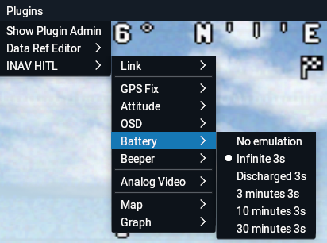

*Select voltage meter type: "FAKE" in configurator*

## Pitot

If enabled in menu, airspeed from X-Plane will replace readings of pitot. 

Pitot should be enabled in INav Configurator. 

It is possible to use VIRTUAL pitot device. 

*Virtual pitot measurements will be overwritten by simulator if emulation is selected in the menu. Otherwise, virtual pitot will estimate speed as usual.*

*Note: VIRTUAL pitot is not supported on 411 and 722 CPUs in INav 5.x and 6.x - you will not be able to arm.*

*Note: VIRTUAL pitot will fail initialize if GPS sensor is disabled in configuration.*

# OSD 

OSD is rendered in **X-Plane** exactly as configured in **INAV Configurator**. 

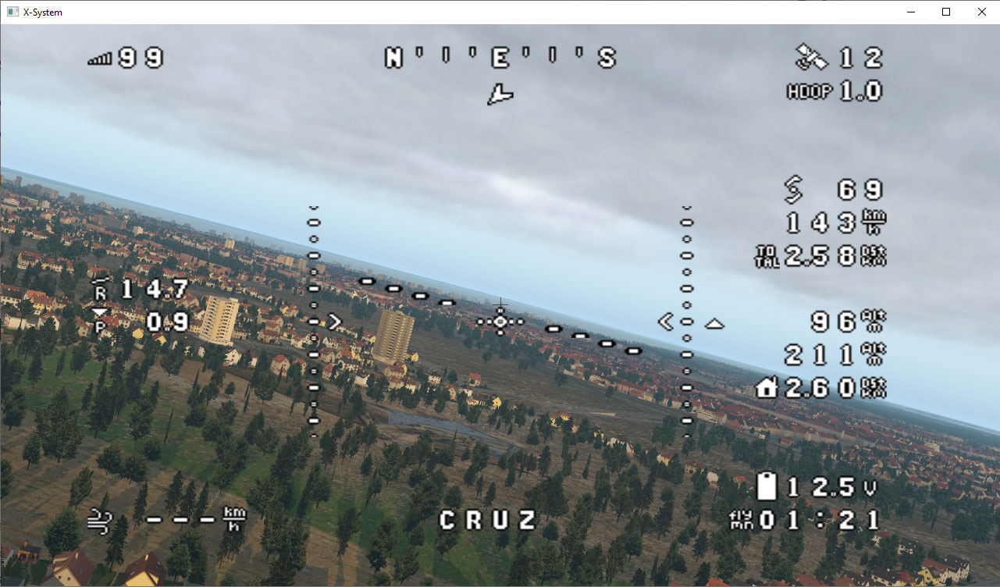

Both **Analog OSD** and **HD OSD** are supported (HD OSD requires Plugin v1.4.0 and INav 7.0)

The following requirements should be met to have **analog OSD** drawn in **X-Plane**:

- OSD should be configured as `AUTO`, `PAL` or `NTSC` type in "OSD" tab in **INAV Configurator**.
- OSD should be enabled in "Configuration->Other features->OSD" in **INAV Configurator**.
- OSD chip should be present on Flight Controller (MAX7456).

Analog OSD will not work without MAX7456 compatible chip. 

The following requirements should be met to have **HD OSD** drawn in **X-Plane**:

- OSD should be configured as `HDZERO`, `DJIWTF`, `AVATAR`, `BF43COMPAT` or `BFHDCOMPAT` type in "OSD" tab in **INAV Configurator**.
- OSD should be enabled in "Configuration->Other features->OSD" in **INAV Configurator**.
- `MSP Displayport` peripheral should be chosen on any UART.

The following options are present in menu:

 

- **AUTO:** number of analog OSD lines is provided by FC
- **PAL:** force rendering of 16 OSD lines (analog OSD) 
- **NTSC:** force rendering of 13 OSD lines (analog OSD)
- **Smoothing: Nearest:** Use nearest pixels for characters rendering
- **Smoothing: Linear:** Use linear smoothing for characters rendering

# Beeper

For convience, it is possible to mute beeper in simulation mode:


# Analog Video link quality simulation

Plugin will simulate analog video link quality acccording to setting. Home point is independent from FC home point. Home point is set to position on ARM.


# Flight path drawing 

Plugin can draw flight path on X-Plane map. 

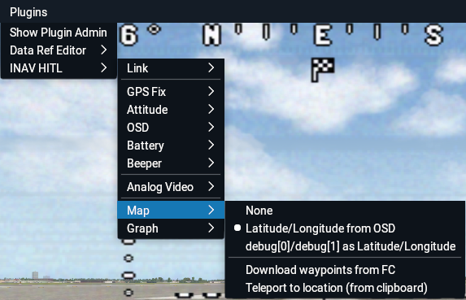

Coordinates can be extracted from:
- **Latitude/Longitude from OSD** -  extracted from OSD. Note that these number have low accuracy and are not updated synchronously. Path will have jittering under zoom.
- **debug[0]/debug[1] as Latitude/Longitude** - assumed that coordinates are provided in debug[0]/debug[1] variables by custom INAV build (int32_t, int32_t).

Other menu options:
- **Download waypoints from FC** - this option will download Mission waypoints from FC and show on X-Plane map (in pink color)
- **Teleport to location** - See [Teleporting to GPS coordinates](setup.md#teleporting-to-gps-coordinates).

Path is drawn on "INAV HITL" layer:
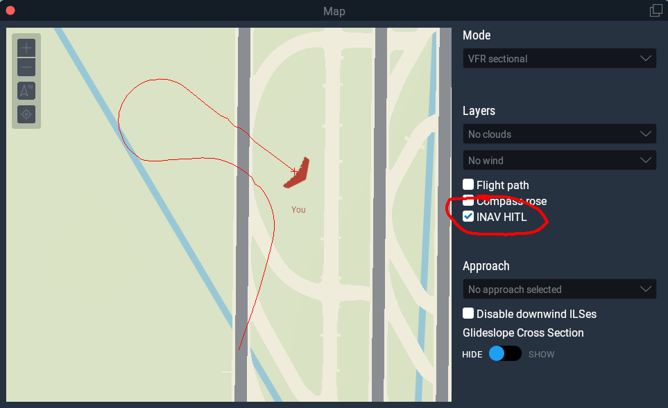

# Teleporting to GPS coordinates

An option in **Map** menu allows to teleport plane to any GPS location from clipboard. 

Right click in Google Maps, then click on the coordinates to copy them to clipboard:

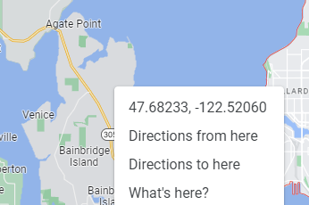

Then select **Plugin->INAV HITL->Map->Teleport to location (from clipboard)**

This works Ok for small distances. If you teleport to the other side of the Earth, you may find yourself in the empty space. Try to teleport again, it usually works.

# Servo autotrim

Autotrim and servo autotrim have no effect in simulation (TODO).

# SITL connection 

INAV SITL connection is supported since v 1.4.0.

Unfortunatelly, current INav Configurator 7.0.x contains outdated SITL executable, also with critical bug which prevents using it with INav-HTIL-Plugin: https://github.com/iNavFlight/inav/pull/9564.

Please download fixed SITL executable from artefacts of pull https://github.com/RomanLut/inav/actions/runs/9848753771?pr=15, unpack and replace **inav_STIL.exe** in the directory
**\resources\sitl\windows\** inside INav Configurator 7.0.x directory (or **\resources\sitl\linux\inav_SITL** for Linux).

Start SITL in configurator-only mode (do not select X-Plane/Realflight simulator).

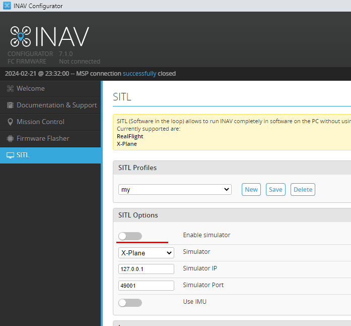

Connect INav Configurator to SITL and do minimal setup:


Connect simulator using an option in X-Plane menu: select virtual **UART** which has MSP connection enabled in configurator and is not occupied by curent configurator connection:

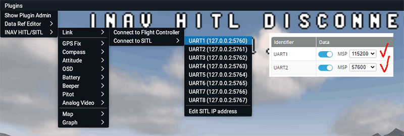


## Known issues with SITL
- Configrator stuck while appling presets ("Airplane without tail etc") https://github.com/iNavFlight/inav-configurator/pull/1922. 
Give it a minute, close, reconnect and "Load and apply" mixer settings in Mixer tab manually.

- Serial-to-TCP app may not start. You may need to start it manually, f.e. ```\resources\sitl\windows\Ser2TCP.exe --comport=COM7 --baudrate=420000 --stopbits=One --parity=None --ip=127.0.0.1 --tcpport=5762``` for ELRS receiver connected to COM7.

- If you see "unable to bind socket" error while starting SITL, kill inav_STIL.exe process in Task Manager.

- It is impossible to calibrate accelerometer - not a problem, it will work with uncalibrated accelerometer.

- SITL does not include "analog OSD" emulation. Enable MSP Display Port on any UART to enable HD OSD.
